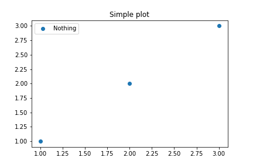

## Basic Tutorial

We can add different content on seperate pages easily
[Link to base tutorial](./original_index.md)

We can also change how text looks with HTML
{: style="font-size: 85%; text-align: center;"}

## Basic Plot Example

Can plot based on a link to anywhere on web, so in first case, to static link on githuh

Otherwise, we can show the image with a relative link, but this means we need to save it in the docs folder (/basic_plot.png)

## Plotly / Interactive Figure Example

We can add the figure using includes



And / or if we add the html in the docs folder, we can link to it directly
[Link to its own page](./plotly.html)

## Map Example

[We can link to the base map directly](./example_map.html)

But, if we try to include the html directly it won't work, even though it
is saved in the includes folder,



The reason is that we need for some HTML, to wrap it in an IFrame, now if 
we use includes on the IFrame wraped and saved map, we can nest in on the page.



## Table Examples

First version of table, w/ default settings



Second with a tiny bit more customization 


